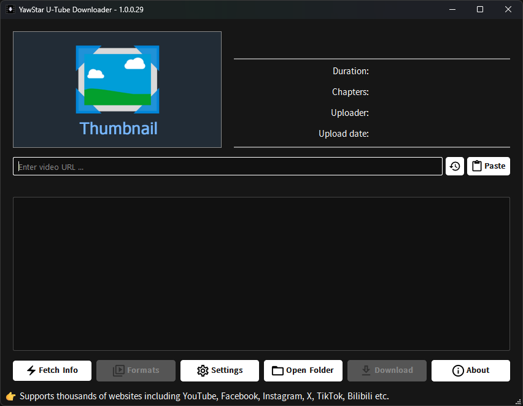
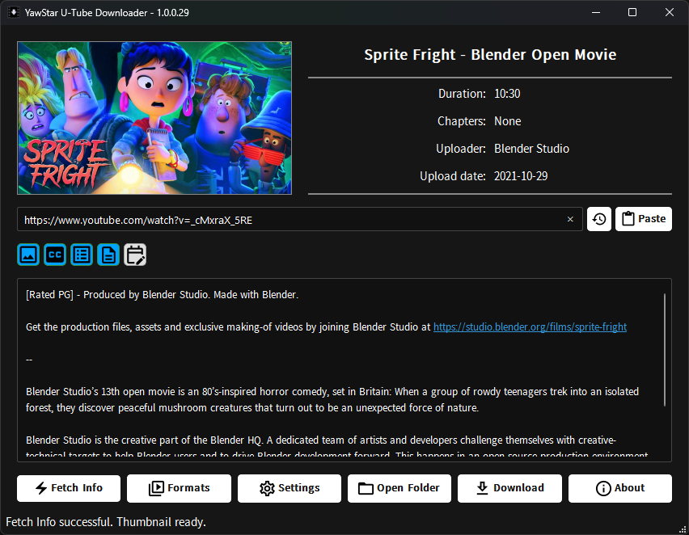
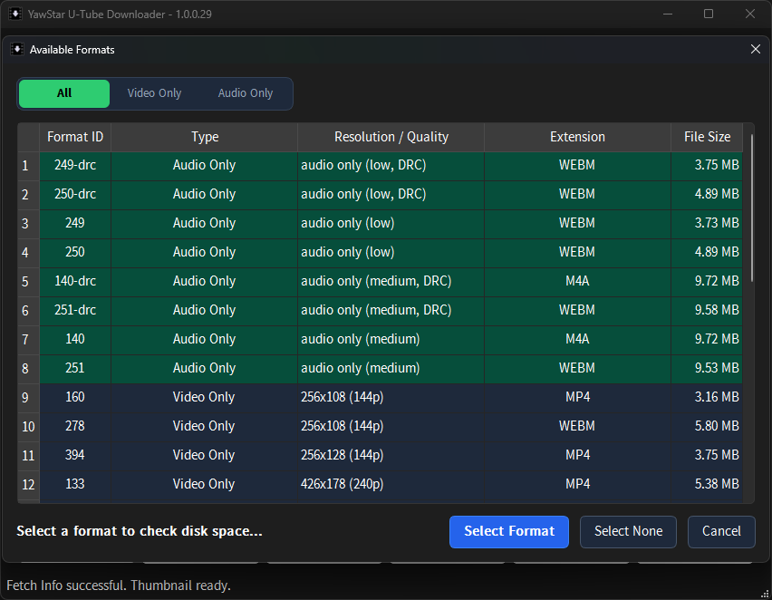
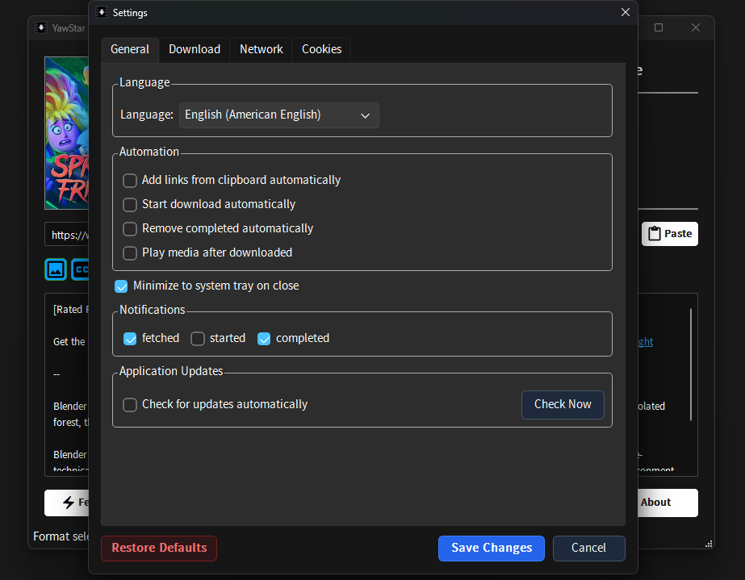
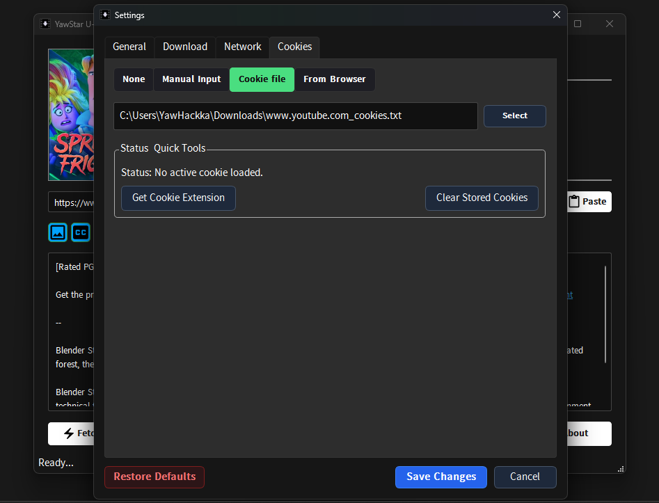
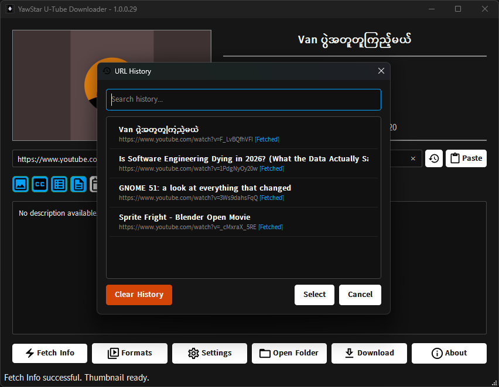
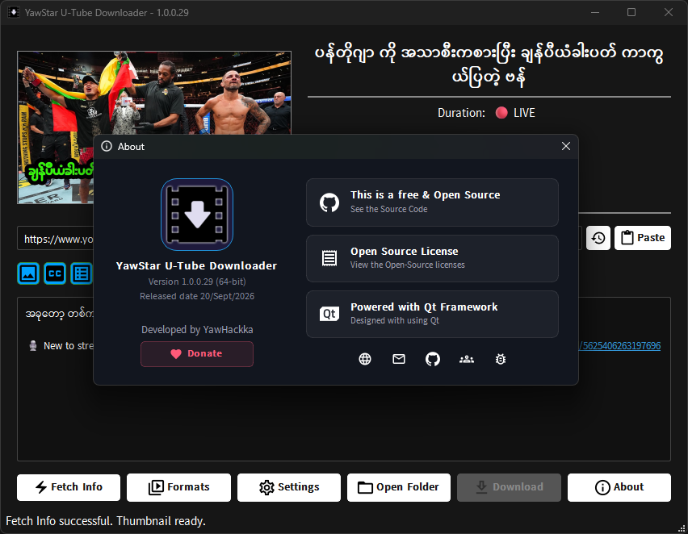

# YawStar U-Tube Downloader

**An advanced, modern, and user-friendly desktop application built with Python and PySide6 (Qt) for downloading high-quality videos, audio, and playlists from YouTube and thousands of supported websites using `yt-dlp`, `Deno`, and `ffmpeg`.**


---

## 📑 Table of Contents

- [Screenshots](#-screenshots)
- [Key Features](#-key-features)
- [Project Structure](#-project-structure)
- [Getting Started](#-getting-started)
- [Configuration & Storage](#️-configuration--storage)
- [Version History Highlights](#-version-history-highlights)
- [Contributing](#-contributing)
- [Support the Developer](#-support-the-developer)
- [Credits](#-credits)
- [License](#-license)
- [Disclaimer](#️-disclaimer)

---

## 📸 Screenshots

<p align="center">
  <h3>Main Interface</h3>
  
</p>

<p align="center">
  <h3>Fetched Info</h3>
  
</p>

<p align="center">
  <h3>Format Selector</h3>
  
</p>

<p align="center">
  <h3>Preferences & Settings</h3>
  
  
</p>

<p align="center">
  <h3>URL History Dialog</h3>
  
</p>

<p align="center">
  <h3>About Dialog</h3>
  
</p>

---

## 🌟 Key Features

- **🚀 Advanced Process Engine**: Powered by native `QProcess` system management for fluid multi-process execution (`yt-dlp`, `ffmpeg`, `deno`).
- **📊 Real-time Progress Tracking**: Shows percentage, download speed, total size, elapsed time, ETA, and native Windows Taskbar progress integration (`ITaskbarList3`).
- **🎛️ Format Selection Dialog**: Pick specific video & audio streams and resolutions.
- **🎨 Rich Metadata & Media Embedding**: Option to embed video thumbnails, video chapters, subtitles, and full metadata tags directly into output files.
- **📌 Magnet Window / Snap to Edges**: Smooth snapping functionality when moving application windows near screen edges.
- **📋 Automatic Clipboard Monitor**: Detects copied media links on the fly for seamless link downloading.
- **🖼️ High-Res Thumbnail Viewer & Downloader**: Interactive context menu for viewing and saving original HD video thumbnails (`WebP`, `JPG`, `PNG`). _Right-click the thumbnail to download just the thumbnail._
- **🍪 Cookie Management & Grabber**: Supports multiple authentication methods (`None`, `File`, `Manual Text`, `Browser Cookies`) to easily bypass bot checks or age-restricted videos.
- **🌐 Network & Proxy Controls**: Native support for socket timeouts, proxy configs (`HTTP/SOCKS`), and speed limit thresholds.
- **🔔 Native System Tray Integration**: Minimizes to System Tray, desktop notifications on completion, and single-instance application control via `SingletonApplication`.
- **📦 Built-in Dependency Downloader**: Built-in dialog to quickly verify and fetch required external binaries (`yt-dlp`, `ffmpeg`, `deno`).
- **🌍 Multi-language & Font Support**: Bundled Myanmar fonts (Pyidaungsu, YawStar UI, ZawgyiOne2008) with UI translation-ready assets.

---

## 🛠️ Project Structure

```text
YawStar-U-Tube-Downloader/
│   .gitignore                  # Git Version Control ထဲ မထည့်ချင်သော ဖိုင်များကို သတ်မှတ်သည့်ဖိုင်
│   .python-version             # uv package manager အတွက် သုံးမည့် Python version Pin ဖိုင်
│   build.py                    # Application ကို Executable (.exe) အဖြစ် ပြောင်းလဲပေးသည့် Build Script
│   Changelog.txt               # Version တစ်ခုချင်းစီ၏ ပြင်ဆင်ချက်မှတ်တမ်းများ
│   LICENSE                     # Open Source License အချက်အလက်များ (MIT License)
│   main.py                     # Program စတင်ပွင့်မည့် ပင်မ Main Entry Point ဖိုင်
│   pyproject.toml              # Project ၏ Dependencies နှင့် Metadata များကို သတ်မှတ်သည့် Configuration ဖိုင်
│   README.md                   # Project အကြောင်း ရှင်းလင်းချက် Documentation ဖိုင်
│   requirements.txt            # Python Packages များ စာရင်း
│   uv.lock                     # uv package manager ၏ Dependency Lock ဖိုင်
│
├───app_platform/               # Application Run-time Platform နှင့် ဆက်စပ်သော Module များ
│       application.py          # App တစ်ခုထဲသာ ပွင့်စေရန် ထိန်းချုပ်ပေးသည့် (Singleton) Handler
│
├───assets/                     # App တွင် သုံးမည့် UI အရင်းအမြစ် Asset ဖိုင်များ
│   │   resources.qrc           # Qt Resource XML Manifest ဖိုင်
│   │   resources_rc.py         # PySide6 သို့ Compile လုပ်ထားပြီးသား Resource ဖိုင်
│   │   __init__.py
│   │
│   ├───fonts/                  # App ထဲတွင် ပါဝင်သည့် မြန်မာ ဖောင့်များ
│   │       pyidaungsu.ttf      # Pyidaungsu Font
│   │       yawstar_ui.ttf      # YawStar Custom UI Font
│   │       zawgyione2008.ttf   # Zawgyi Font
│   │
│   ├───icons/                  # Taskbar နှင့် Status Icon များ (.ico)
│   │       about.ico           # About Dialog Icon
│   │       app_icon.ico        # Main App Icon
│   │       completed.ico       # Download ပြီးစီးကြောင်း Icon
│   │       downloading.ico     # Download လုပ်နေဆဲ Icon
│   │       error.ico           # Error ဖြစ်ပေါ်သည့် Icon
│   │       exec.ico            # Process Executing Icon
│   │       history.ico         # Download History Icon
│   │       info.ico            # Information Icon
│   │       waiting.ico         # Waiting/Pending Icon
│   │
│   └───images/                 # UI Context Menu နှင့် Button များတွင် သုံးသည့် SVG/PNG/GIF ဖိုင်များ
│           about.svg           # About SVG Icon
│           bug_report.svg      # Bug Report SVG Icon
│           chapters.svg        # Video Chapters SVG Icon
│           default_thumbnail.jpg# Thumbnail မရသည့်အခါ ပြမည့် Default ပုံ
│           download.svg        # Download Button Icon
│           fetch_Info.svg      # Fetch Info Button Icon
│           formats.svg         # Format Selector Icon
│           github.svg          # GitHub Link Icon
│           globe.svg           # Language/Website Icon
│           groups.svg          # Social Group Icon
│           heart.svg           # Donation/Support Icon
│           heart_pink.svg      # Support Icon (Pink)
│           history.svg         # History List Icon
│           license.svg         # License Information Icon
│           loading.gif         # Loading Progress GIF animation
│           mail.svg            # Contact Email Icon
│           metadata.svg        # Metadata Setting Icon
│           m_time.svg          # Duration/Time Icon
│           open_folder.svg     # Folder Open Icon
│           paste.svg           # Paste URL Icon
│           qt_dark.svg         # Qt Dark Theme Logo
│           settings.svg        # Preferences/Settings Icon
│           setup_icon.png      # Installer Setup Image
│           subtitles.svg       # Subtitle Option Icon
│           thumbnail.svg       # Thumbnail View Icon
│           translate.svg       # Translation Icon
│
├───controllers/                # Logic Control နှင့် Process စီမံခန့်ခွဲသည့် Controller များ
│       download_controller.py  # Download ရယူသည့် Process များကို ထိန်းချုပ်သည့် Logic
│       fetch_controller.py     # Video/Playlist Information Fetch လုပ်သည့် Logic
│       __init__.py
│
├───core/                       # Main System Core Services နှင့် Logic များ
│   │   clipboard_monitor.py    # Clipboard (Copy ကူးလိုက်သည့် Link) များကို စောင့်ကြည့်သည့် Thread
│   │   config_manager.py       # User Settings (JSON Configuration) စီမံပေးသည့် Manager
│   │   constants.py            # App ၏ သတ်မှတ်ချက် Constant တန်ဖိုးများ
│   │   db_manager.py           # History နှင့် Database သိုလှောင်မှုကို စီမံသည့် Manager
│   │   dependency_downloader.py# External Binaries (yt-dlp, ffmpeg, deno) ဒေါင်းလုဒ်ဆွဲပေးသည့် GUI
│   │   dependency_downloader1.py# Dependency Downloader နမူနာ/အပို ဖိုင်
│   │   global_constants.py     # App Version, Company Name စသည့် Global Metadata တန်ဖိုးများ
│   │   __init__.py
│   │
│   └───services/               # Core Background Service များ
│           file_opener.py      # Download ပြီးစီးသော ဖိုင်/Folder များကို ဖွင့်ပေးသည့် Service
│           font_service.py     # Custom Font Loading နှင့် Management Service
│           notification_service.py # System Tray Notifications များ ထုတ်ပေးသည့် Service
│           notification_service1.py # Notification Service နမူနာ/အပို ဖိုင်
│           taskbar_service.py  # Windows Taskbar Progress API ကို ထိန်းချုပ်သည့် Service
│           thumbnail_service.py# HD Video Thumbnail များ Downloader/Viewer Service
│           yt_dlp_service.py   # yt-dlp Process နှင့် Command Arguments စီမံသည့် Service
│           __init__.py
│
├───dist/                       # Installer (Inno Setup) နှင့် Output Executable ဖိုင်များထားရာ
│       app_icon.ico            # Installer Desktop Icon
│       License Agreement.txt   # Software License စာချုပ်ဖိုင်
│       Setup.iss               # Inno Setup Script (Exe Installer ထုတ်ရန်)
│       setup_icon.ico          # Installer Setup File Icon
│       v1.0.0.29_x64_config.json # Build Config Snapshot
│       version-file.txt        # Executable ၏ File Version Metadata
│       YawStar.URL             # App Website Shortcut Link
│
├───screenshots/                # Documentation (README) အတွက် Application UI စခရင်ရှော့များ
│       about_dialog.png        # About Dialog Screenshot
│       fetched_info.png        # Fetched Information UI Screenshot
│       format_selection.png    # Format Selection Dialog Screenshot
│       main_window.png         # Main Application Window Screenshot
│       preferences_cookies.png # Cookie Settings Panel Screenshot
│       preferences_general.png # General Settings Panel Screenshot
│       url_history.png         # URL History Dialog Screenshot
│
├───ui/                         # User Interface (PySide6 UI) ဖိုင်များ
│       about.py                # About Dialog UI Logic
│       format_dialog.py        # Audio/Video Format ရွေးချယ်သည့် UI Logic
│       history_dialog.ui       # Qt Designer History Window File
│       i_taskbar3.py           # Windows Taskbar API COM Bindings
│       settings_dialog.py      # Preferences/Settings Panel UI Logic
│       settings_dialog.ui      # Qt Designer Settings Window File
│       ui_history.py           # Python ဖြင့် ဖွဲ့စည်းထားသော History UI View
│       ui_main.py              # Main Window UI Bindings နှင့် Layouts
│
└───utils/                      # Helper & Utility Functions များ
        logger.py               # Application Log မှတ်တမ်းတင်သည့် Utility
        process_utils.py        # Subprocess နှင့် Process Management Utilities
        text_utils.py           # Text Processing, Title Sanitation နှင့် Format Utility များ
        __init__.py
```

---

## 🚀 Getting Started

### Prerequisites

- **Python 3.9+ (Recommand: 3.13.13)**
- **uv** (An extremely fast Python package and project manager)
- **Supported OS**: Windows 10/11 (fully featured with taskbar integration), Linux, macOS.

### Installation & Execution with `uv`

1. **Clone the repository:**

   ```bash
   git clone https://github.com/yawstar/u-tube-downloader.git
   cd u-tube-downloader
   ```

2. **Sync and install dependencies:**

   ```bash
   uv sync
   ```

3. **Run the application:**

   ```bash
   uv run main.py
   ```

---

## ⚙️ Configuration & Storage

Application configurations and cache data are automatically saved under standard platform user data directories:

- **Windows**: `%LOCALAPPDATA%\YawStar\YawStar Downloader\config.json`
- **Linux**: `~/.local/share/YawStar/YawStar Downloader/config.json`
- **macOS**: `~/Library/Application Support/YawStar/YawStar Downloader/config.json`

### Supported Cookie Modes

- **None**: Download public media without credentials.
- **Browser**: Extract authentication cookies directly from installed browsers (Chrome, Edge, Firefox, Brave).
- **File**: Import a `.txt` cookie file (Netscape format).
- **Manual**: Paste cookie string content directly in settings.

---

## 📝 Version History Highlights

- **v1.0.0.29**: HD Thumbnail exporter & Auto-Play on complete.
- **v1.0.0.28**: Windows Taskbar integration (`ITaskbarList3`), PEP 8 refactoring, Singleton instance lock.
- **v1.0.0.27**: Enhanced cookies handling & title length sanitation.
- **v1.0.0.26**: System Tray background downloading & single instance execution.
- **v1.0.0.21**: Format selection dialog and rich Preferences/Settings panel.
- **v1.0.0.14**: Migrated process management to native Qt `QProcess`.

---

## 🤝 Contributing

Contributions, issues, and feature requests are welcome!
Feel free to check the [issues page](../../issues) or submit a pull request.

---

## 💖 Support the Developer

If you find this app useful, consider supporting its development:

- ⭐ Star this repository
- 🐛 Report bugs or suggest features via [Issues](../../issues)
- ❤️ [Donate](https://yawstardancebox.github.io/donate/)
- 🌍 Help with translations

---

## 🙏 Credits

- [yt-dlp](https://github.com/yt-dlp/yt-dlp)
- [FFmpeg](https://ffmpeg.org/)
- [Deno](https://deno.land/)
- [PySide6](https://doc.qt.io/qtforpython/)

---

## 📄 License

This project is licensed under the MIT License — see the [LICENSE](LICENSE) file for details.

---

## ⚠️ Disclaimer

This tool is intended for **personal use only**. Please respect copyright laws and the terms of service of the websites you download from. The developer is not responsible for any misuse.
